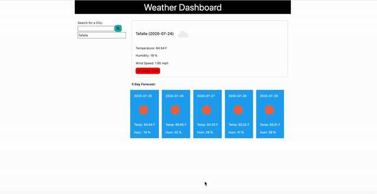

# Weather_Dasboard

Weather application capable of displaying weather information and forecasts. Capable of displaying current day weather information and also display a 5-day forecast of selected city.

[link to website](https://musicman785.github.io/Weather_Dasboard/)

# Technologies Used

> 1. Javascript
> 2. CSS
> 3. HTML
> 4. Open Weather api
> 5. JQuery

# Table of Contents

- [Instructions](#instructions)
- [License](#license)
- [Gif](#gif)
- [Author](#author)

## Instructions

> Open your web browser and navigate to https://musicman785.github.io/Weather_Dasboard/. Once the window opens, go to the input field and insert a valid city and hit the "enter" icon. All current and five-day weather forcast should display. You can go back to a previously searched city by simply clicking on them in the list.

## License

[Not Applicable](#)

## Contributors

[musicman785](http://github.com/musicman785)

### Gif:

## Author

**musicman785**

Email: null

Location: Los Angeles

Github: https://github.com/musicman785
